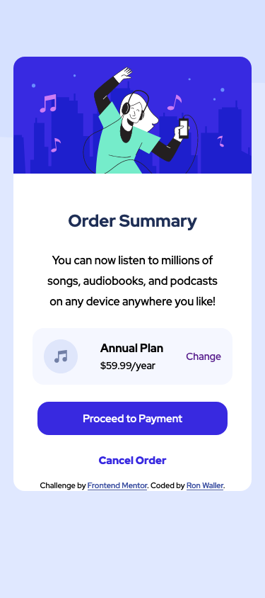

# Frontend Mentor - Order summary card solution

This is a solution to the [Order summary card challenge on Frontend Mentor](https://www.frontendmentor.io/challenges/order-summary-component-QlPmajDUj). Frontend Mentor challenges help you improve your coding skills by building realistic projects.

## Table of contents

- [Overview](#overview)
  - [The challenge](#the-challenge)
  - [Screenshot](#screenshot)
  - [Links](#links)
- [My process](#my-process)
  - [Built with](#built-with)
  - [What I learned](#what-i-learned)
  - [Continued development](#continued-development)
- [Author](#author)
- [Acknowledgments](#acknowledgments)

## Overview

### The challenge

Users should be able to:

- See hover states for interactive elements

### Screenshot

### Links

- Solution URL: [Solution URL](https://www.frontendmentor.io/solutions/responsive-card-layout-using-flexbox-47oAIu2A0)
- Live Site URL: [Live site URL here](https://nervous-nightingale-6afb57.netlify.app/)

## My process

### Built with

- Semantic HTML5 markup
- CSS custom properties
- Flexbox
- Mobile-first workflow

### What I learned

I have been learning how to create layouts that remain responsive by not using "fixed" units like px. By using em or rem,percentages , and min-width or max width this allows elements to grow and shrink as needed

### Continued development

What to continue to learn about responsive layouts using Flexbox and Grid.

## Author

- Frontend Mentor - [@RonWaller](https://www.frontendmentor.io/profile/RonWaller)
- Twitter - [@ronjw1](https://www.twitter.com/yourusername)

## Acknowledgments

Once again like to acknowledge Kevin Powell for his knowledge about responsive layouts and CSS.
